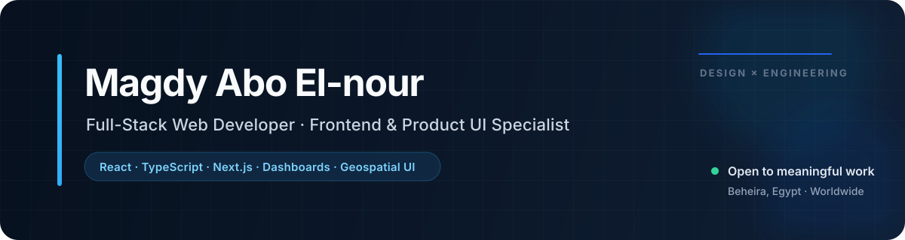
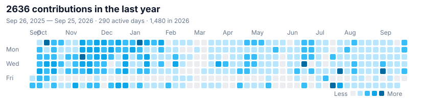

  

   

  
  
  
  
  

## About

I am a **Full-Stack Web Developer with a frontend specialty**, building products where thoughtful interface design meets reliable engineering. My work ranges from geospatial intelligence dashboards and multi-role admin systems to healthcare platforms, B2B marketplaces, and polished brand experiences.

I care about turning complex workflows into interfaces that feel clear, fast, and natural—supported by reusable components, maintainable architecture, and close attention to interaction details.

<table>
  <tr>
    <td width="33%" valign="top">
      <strong>Currently</strong> 
      Frontend Developer 
      Neea Studios Ltd
    </td>
    <td width="34%" valign="top">
      <strong>Specialized in</strong> 
      Product UI &amp; geospatial apps 
      Dashboards · Maps · Analytics
    </td>
    <td width="33%" valign="top">
      <strong>Based in</strong> 
      Beheira, Egypt 
      Working with teams worldwide
    </td>
  </tr>
</table>

## Experience

### Frontend Developer · Neea Studios Ltd

`Mar 2026 — Present` · Remote, Plymouth, United Kingdom

Develop and maintain a React and TypeScript geospatial intelligence platform for admin and client workflows. The product includes stakeholder databases, project dashboards, map templates, data tools, campaign management, page-builder widgets, analytics, role-based routing, forms, uploads, and interactive visualizations.

`React` `TypeScript` `Vite` `Tailwind CSS` `shadcn/ui` `Zustand` `TanStack Query` `Mapbox` `Leaflet` `Highcharts` `ECharts` `AWS Amplify`

### Frontend Developer · Freelance

`May 2024 — Present` · Remote

Build responsive web applications and modern product interfaces for clients, translating business requirements and visual direction into maintainable React and Next.js experiences.

`React` `Next.js` `React Native` `TypeScript` `Tailwind CSS` `Redux Toolkit` `RTK Query` `Zustand` `TanStack Query`

### Frontend Web Developer · PioneerTecsa

`Sep 2025 — Jan 2026`

Helped build a modern corporate website for an industrial engineering and construction company, delivering responsive layouts, business-facing interactions, and polished motion across the experience.

`Next.js` `React` `TypeScript` `Tailwind CSS` `Laravel` `Inertia.js` `GSAP` `Framer Motion` `Bootstrap`

### Full-Stack Developer Trainee · Route Academy

`Jan 2024 — Apr 2025`

Completed hands-on full-stack training focused on building complete applications with modern frontend architecture, REST APIs, authentication, databases, and deployment workflows.

`React` `Next.js` `Node.js` `Express` `MongoDB` `SQL` `REST APIs` `TypeScript`

### Web Developer Intern · Local Tech Academy

`Jan 2024 — Apr 2024`

Contributed to frontend development in a professional environment while strengthening responsive design, collaboration, version control, and Agile delivery practices.

`HTML` `CSS` `JavaScript` `React` `Tailwind CSS` `Bootstrap` `Git` `GitHub`

## Selected work

<table>
  <tr>
    <td width="50%" valign="top">
      <strong>Estockeh</strong> 2026 · B2B marketplace  
      Industrial marketplace with advanced discovery, bulk inquiries, and supplier-to-procurement workflows.  
      Next.js · TypeScript · Tailwind CSS · shadcn/ui
    </td>
    <td width="50%" valign="top">
      <strong>Points Xpert</strong> 2026 · Product platform  
      Loyalty and rewards platform with clear dashboards for engagement, redemption cycles, and membership tiers.  
      Next.js · TypeScript · Tailwind CSS · TanStack Query
    </td>
  </tr>
  <tr>
    <td width="50%" valign="top">
      <strong>BrandiClick</strong> 2025 · Web application  
      Digital agency portal with immersive service discovery, client interaction tools, and streamlined onboarding.  
      React · TypeScript · Tailwind CSS · UI design
    </td>
    <td width="50%" valign="top">
      <strong>Pioneer Tecsa</strong> 2025 · Corporate website  
      International engineering website built for clear project presentation, service discovery, and business growth.  
      Next.js · Tailwind CSS · Responsive design
    </td>
  </tr>
  <tr>
    <td width="50%" valign="top">
      <strong>Medeucare</strong> 2025 · Healthcare  
      Medical facilitation platform connecting international patients with trusted European care providers.  
      React · TypeScript · Inertia.js · Laravel
    </td>
    <td width="50%" valign="top">
      <strong>Plump Clinics</strong> 2025 · Healthcare  
      Clinical operations platform for scheduling, patient records, and an improved consultation journey.  
      React · Laravel · Tailwind CSS · shadcn/ui
    </td>
  </tr>
</table>

  <a href="https://www.magdyaboelnour.me/"><strong>Explore all case studies on my portfolio →</strong></a>

## Capabilities

| Area | Technologies |
| --- | --- |
| **Frontend engineering** | JavaScript (ES6+), TypeScript, React, Next.js, Vite, React Native |
| **UI systems** | Tailwind CSS, shadcn/ui, MUI, Bootstrap, Sass, Framer Motion, GSAP |
| **State & data flow** | Redux Toolkit, RTK Query, Zustand, TanStack React Query, Axios |
| **Forms & validation** | React Hook Form, Zod, reusable CRUD workflows, authentication guards |
| **Backend & data** | Node.js, Express, MongoDB, SQL, REST APIs, Firebase, Supabase |
| **Maps & visualization** | Mapbox, Leaflet, Highcharts, ECharts, Chart.js |
| **Delivery** | Git, GitHub, Postman, AWS Amplify, Vercel, Agile collaboration, Figma-to-code |

## Education

**B.Sc. in Computer Science** · Damanhour University 
`Sep 2021 — Jun 2025`

**Full-Stack Node.js Diploma** · Route Academy 
`Jan 2024 — Apr 2025`

Core study includes programming fundamentals, object-oriented programming, data structures, databases, networking, frontend engineering, backend APIs, authentication, and deployment.

## Contributions in the last year

  
   
  Official GitHub contribution data · exact rolling 365-day window

## Let's build something useful

I am always interested in thoughtful products, ambitious teams, and collaborations where strong engineering and a refined user experience matter.

**[View my latest work](https://www.magdyaboelnour.me/)** · **[Connect on LinkedIn](https://www.linkedin.com/in/magdy-abo-el-nour-672997322/)** · **[Send an email](mailto:magdy.aboelnour246@gmail.com)**

 

  My portfolio and LinkedIn are the live sources for current roles, availability, and newly published work.
   
  

